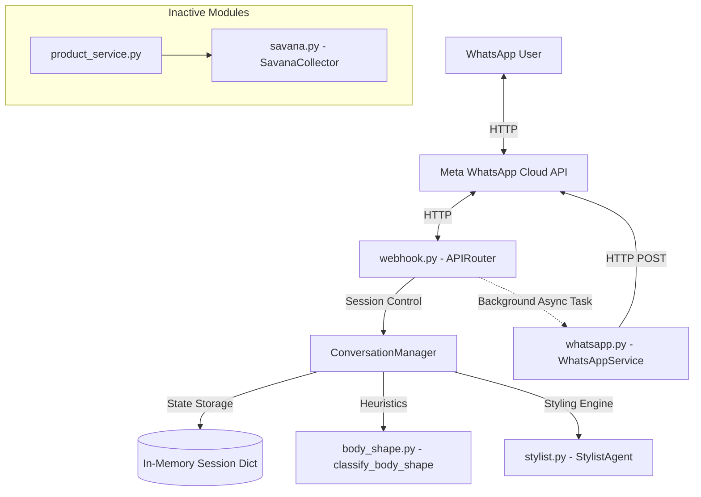
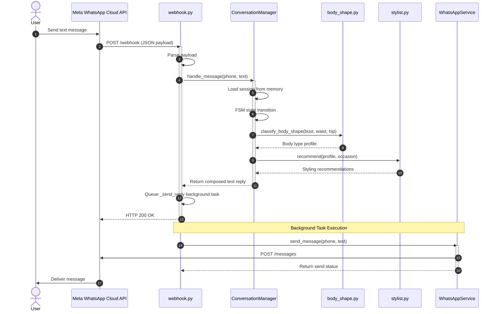
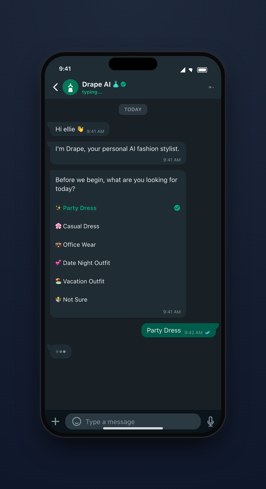
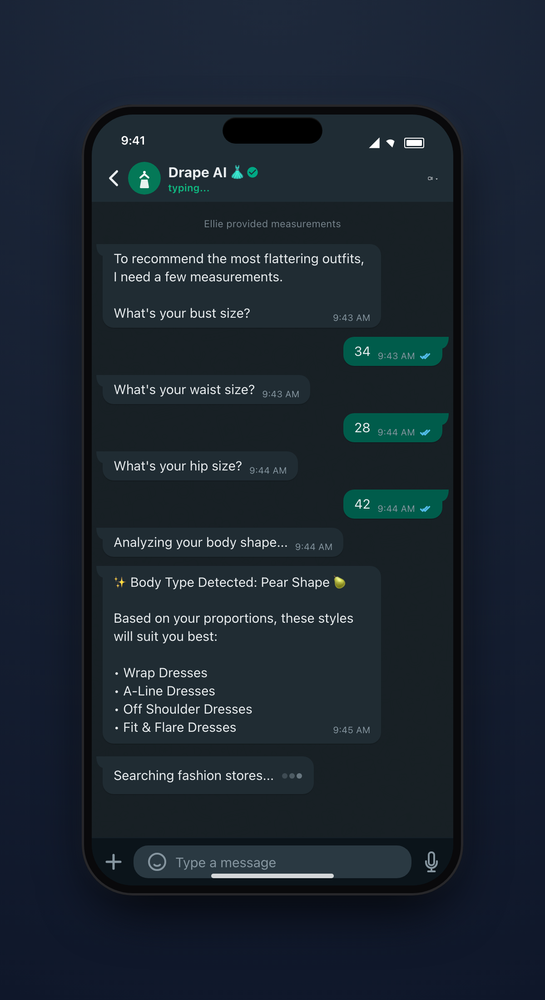
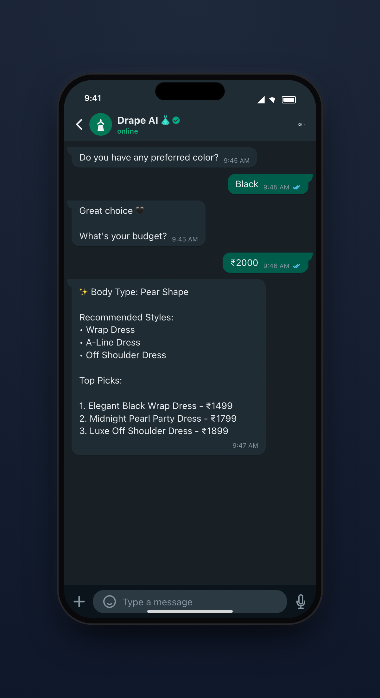

# DRAPE — WhatsApp Fashion Assistant

DRAPE is a backend application designed around a WhatsApp conversational experience. The system gathers body measurements and style preferences, identifies suitable silhouettes, and outputs text-based clothing recommendations.

---

## Table of Contents

- [Overview](#overview)
- [Architecture](#architecture)
- [Request Flow](#request-flow)
- [Project Structure](#project-structure)
- [Components](#components)
- [Tech Stack](#tech-stack)
- [Features](#features)
- [Design Decisions](#design-decisions)
- [Setup & Installation](#setup--installation)
- [API Reference](#api-reference)
- [Screenshots](#screenshots)
- [Future Work](#future-work)
- [Repository Assessment](#repository-assessment)

---

## Overview

DRAPE exposes a FastAPI webhook connected to the Meta WhatsApp Cloud API. When a user sends a message, a Finite State Machine (FSM) collects bust, waist, and hip measurements, budget, color preference, and occasion. The system classifies the user's body shape (Pear, Inverted Triangle, Hourglass, or Rectangle), maps it to ideal garment silhouettes using a rule-based styling engine, and replies with structured text recommendations.

Currently, user sessions are kept in memory, and the e-commerce search collector is implemented as a standalone module that is not integrated into the active conversational pipeline.

---

## Architecture



---

## Request Flow



---

## Project Structure

```text
.
├── README.md
├── app/
│   ├── agents/
│   │   ├── __init__.py
│   │   ├── body_shape.py
│   │   └── stylist.py
│   ├── collectors/
│   │   ├── __init__.py
│   │   └── savana.py
│   ├── core/
│   │   ├── __init__.py
│   │   ├── config.py
│   │   └── conversation.py
│   ├── main.py
│   ├── models/
│   │   ├── __init__.py
│   │   └── schemas.py
│   ├── requirements.txt
│   ├── routers/
│   │   ├── __init__.py
│   │   └── webhook.py
│   └── services/
│       ├── __init__.py
│       ├── product_service.py
│       ├── recommendation.py
│       └── whatsapp.py
└── assets/
    └── demo/
        ├── chat-1.png
        ├── chat-2.png
        ├── chat-3.png
        ├── dress1.jpg
        ├── dress2.jpg
        └── dress3.jpg
```

---

## Components

### HTTP Routing & Server Initialization
* `app/main.py` - Bootstraps the FastAPI application, mounts the webhook router, and manages application lifecycles.
* `app/routers/webhook.py` - Handles webhook verification (`GET /webhook`) and incoming message consumption (`POST /webhook`).

### Stateful Controllers
* `app/core/config.py` - Pydantic `BaseSettings` interface parsing settings from environment variables.
* `app/core/conversation.py` - Stateful FSM managing conversational steps. Sessions are stored in a dictionary in memory.

### Classification & Styling
* `app/agents/body_shape.py` - Pure function classifying waist-to-hip and waist-to-bust proportions into Pear, Inverted Triangle, Hourglass, and Rectangle shapes.
* `app/agents/stylist.py` - Rule-based catalog engine matching classified body types to silhouettes, color schemes, and accessories.

### Product & Integration Clients
* `app/collectors/savana.py` - HTTP request adapter for the Savana search API, featuring connection pooling and automatic retry backoff.
* `app/services/product_service.py` - Interacts with `SavanaCollector`. Note: Hardcoded to return a single mock product ID and currently disconnected from the conversation flow.
* `app/services/recommendation.py` - Combines classifier and stylist schemas. Note: Currently unused in the live webhook handler.
* `app/services/whatsapp.py` - Async client using `httpx` to send outbound messages via the Meta Graph API.
* `app/models/schemas.py` - Pydantic schemas validating user inputs, product payloads, and recommendation objects.

---

## Tech Stack

* **Web Framework**: FastAPI
* **Data Validation**: Pydantic v2
* **Asynchronous Clients**: HTTPX (WhatsApp API calls)
* **Synchronous Clients**: Requests (Savana collector API)
* **Configuration**: Pydantic Settings
* **Language**: Python 3.10+

---

## Features

### Implemented
* Verification handshake handler (`GET /webhook`).
* Webhook message parsing extracting sender phone and body text.
* Multi-step conversational FSM running the questionnaire.
* Rules-based body shape classification from input measurements.
* Styling catalog scoring outfits against body type profiles.
* Outbound WhatsApp messaging dispatched asynchronously via background tasks.
* External API client with retries and pooling (Savana search).

### In Progress / Partially Implemented
* E-commerce linking: `ProductService` contains a hardcoded stub query (fetching product ID 1859842) and is not integrated into the active conversational pipeline.
* Sizing coverage: The FSM supports Pear, Inverted Triangle, Hourglass, and Rectangle classification; Apple body shape classification logic in `body_shape.py` is missing.

### Planned
* Database state persistence (PostgreSQL/SQLAlchemy) to replace the in-memory dict session store.
* Docker containerization and setup configs.
* Pytest suites for FSM transitions and endpoint responses.

---

## Design Decisions

* **In-Memory Session Caching**: Conversational state is stored in a dictionary keyed by phone numbers. This provides low latency for state changes but does not persist across container restarts or scale horizontally.
* **Non-Blocking Reply Dispatch**: Outbound WhatsApp calls run in FastAPI `BackgroundTasks` to return HTTP 200 immediately, avoiding duplicate deliveries triggered by Meta's retry mechanisms.
* **Separation of I/O**: Sizing and styling engines are written as side-effect-free pure functions, allowing them to be tested without network mocks.

---

## Setup & Installation

### Environment Variables
Create a `.env` file in the `app/` directory:
```ini
APP_ENV=development
VERIFY_TOKEN=your_custom_webhook_verify_token
WHATSAPP_TOKEN=your_meta_access_token
WHATSAPP_PHONE_NUMBER_ID=your_meta_phone_number_id
```

### Local Setup
```bash
# Clone the repository
git clone <repository_url>
cd Drape

# Set up virtual environment
python3 -m venv .venv
source .venv/bin/activate

# Install dependencies
pip install -r app/requirements.txt

# Run application
cd app
uvicorn main:app --reload
```

To expose the local webhook endpoint to Meta Developer dashboard:
```bash
ngrok http 8000
```
Register the HTTPS ngrok forwarding URL (`https://<hash>.ngrok-free.app/webhook`) in the Meta dashboard.

---

## API Reference

### Verification Endpoint
`GET /webhook`

* Query Parameters:
  * `hub.mode`: String (expected: `"subscribe"`)
  * `hub.verify_token`: String (must match `VERIFY_TOKEN` in `.env`)
  * `hub.challenge`: String (echoed on success)

### Incoming Event Callback
`POST /webhook`

* Consumes JSON notifications from the WhatsApp Cloud API and queues replies in background tasks.
* Returns: `{"status": "ok"}`

### Health Status Check
`GET /health`

* Returns: `{"status": "ok", "service": "Drape"}`

---

## Screenshots

### Onboarding & Occasion Selection

*Conceptual MVP Demonstration: WhatsApp welcome messages, introduction, and selection of outfit category.*

### Sizing & Body Shape Analysis

*Conceptual MVP Demonstration: User size dimensions collection and subsequent Pear Shape body type detection.*

### Recommendation Details

*Conceptual MVP Demonstration: Simplified text styling recommendations matching selected criteria.*

---

## Future Work

* **Core Flow Integration**: Connect `ProductService` and `SavanaCollector` into `ConversationManager` to replace plain text styling recommendations with live e-commerce product links.
* **Persistent Session Store**: Move conversation states out of application memory into a PostgreSQL database instance to support horizontal scalability.
* **Docker Containerization**: Add a Dockerfile and docker-compose.yml configuration to simplify multi-service environment setup.

---

## Repository Assessment

* **Maintainability**: High. Modules are isolated, and data payloads are validated explicitly via Pydantic model contracts.
* **Scalability**: Low. Because session state is kept in-memory, horizontal scaling across multiple load-balanced web servers is impossible without sticky sessions or state desynchronization.
* **Extensibility**: Medium. Adding new collectors is straightforward, but the main conversational state engine is highly coupled to static text rules, meaning expanding interactive message options requires refactoring the conversation controller.
